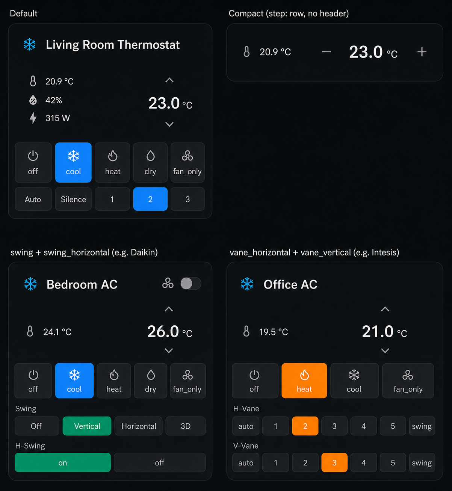

<div align="center">

# Simple Thermostat

### A HVAC, thermostat, climate, fan, and humidifier card for Home Assistant Lovelace UI

[](https://github.com/hacs/integration)
[](https://www.home-assistant.io/)
[](https://github.com/Wheemer/simple-thermostat/releases/latest)
[](https://github.com/Wheemer/simple-thermostat/releases)

<p>
  <strong>⭐ NEW V4 RELEASE ⭐</strong><br>
  Fan, humidifier, dehumidifier, modern actions, and enhanced visuals
</p>

</div>

A Codex assisted, community maintained fork of [simple-thermostat](https://github.com/nervetattoo/simple-thermostat) by [@nervetattoo](https://github.com/nervetattoo), kept working with current Home Assistant releases. The v4 modernization was heavily influenced by [duczz/ha-simple-thermostat](https://github.com/duczz/ha-simple-thermostat).

A compact Lovelace card for Home Assistant climate, fan, humidifier, and dehumidifier entities. It keeps the original small-card style while adding domain-aware setpoints, current values, action handling, richer mode controls, and enhanced visuals.

<div style="border: 1px solid rgba(65, 189, 245, 0.45); border-radius: 8px; padding: 16px 18px; margin: 18px 0;">
  <strong style="color: #41bdf5;">New in v4:</strong> Fan, humidifier, and dehumidifier support, domain-aware controls, modern Home Assistant actions, richer mode buttons, and enhanced visuals.
</div>



<div style="border: 1px solid rgba(65, 189, 245, 0.45); border-radius: 8px; padding: 16px 18px; margin: 18px 0;">
  <strong style="color: #41bdf5;">Requires:</strong> Home Assistant 2024.8 or newer. v4 uses Home Assistant's current frontend action API.
</div>

<div style="border: 1px solid rgba(65, 189, 245, 0.45); border-radius: 8px; padding: 16px 18px; margin: 18px 0;">
  <strong style="color: #41bdf5;">Compatibility:</strong> v4 imports older <code>current_temperature_entity</code>, <code>sensors</code>, and <code>layout.sensors</code> YAML into the current <code>current_value_entity</code>, <code>entities</code>, and <code>layout.entities</code> config shape. If you are staying on v3, use the <a href="https://github.com/Wheemer/simple-thermostat/tree/v3">v3 documentation</a>.
</div>

## Installation

### HACS

[](https://my.home-assistant.io/redirect/hacs_repository/?owner=Wheemer&repository=simple-thermostat&category=plugin)

Or add it manually in HACS:

1. Open **HACS** in Home Assistant.
2. Open **Custom repositories**.
3. Add this repository:

   ```text
   https://github.com/Wheemer/simple-thermostat
   ```

4. Choose type **Dashboard**.
5. Install **Simple Thermostat**.
6. Refresh Home Assistant and clear the browser cache if the old card is still loaded.

### Migrating from another fork

If you installed `simple-thermostat` from another repository, uninstall the old HACS entry first. Then add this repository as the dashboard custom repository and install it again.

If you are not upgrading to v4, keep using the [v3 documentation](https://github.com/Wheemer/simple-thermostat/tree/v3) for the older config surface.

### Manual install

1. Download `simple-thermostat.js` from the [latest release](https://github.com/Wheemer/simple-thermostat/releases/latest).
2. Put it in your Home Assistant `www` folder.
3. Add this Lovelace resource:

   ```yaml
   resources:
     - url: /local/simple-thermostat.js
       type: module
   ```

## Add A Card

Use the Home Assistant visual editor for normal setup. In v4, the card reads the selected entity and shows the options that apply to that device, so most cards no longer need YAML.

1. Open a dashboard and choose **Edit dashboard**.
2. Select **Add card**.
3. Search for **Simple Thermostat**.
4. Pick your climate, fan, humidifier, or dehumidifier entity.
5. Adjust the controls, header toggles, extra entities, and display options in the editor.

The editor handles the common v4 setup:

- Entity and current value selection.
- Climate, fan, humidifier, and dehumidifier controls.
- Header toggles and toggle icons.
- Extra entity rows and layout.
- Setpoint visibility and v4 enhanced visuals.

## Domain Defaults

The card chooses sensible defaults from the selected entity:

| Domain | Target | Current value | Default controls |
| --- | --- | --- | --- |
| `climate` | Temperature | `current_temperature` or configured current value entity | HVAC, preset, fan, swing, vane |
| `fan` | Percentage | Percentage when available | Fan speeds, direction, oscillating, state |
| `humidifier` | Humidity | `current_humidity` | Mode, state |

Dehumidifiers use the Home Assistant `humidifier` domain.

## Advanced YAML

YAML is still supported for advanced customization, migration, and manual dashboard editing, but it is no longer the recommended starting point for v4.

Use the [YAML reference](YAML_REFERENCE.md) for:

- advanced mode filtering,
- custom extra entity templates,
- manual setpoint definitions,
- service overrides,
- target value tap, hold, and double tap actions,
- scoped custom CSS,
- the full option reference.

## Changelog

<table border="1" cellspacing="0" cellpadding="6">
  <thead>
    <tr>
      <th nowrap>Version</th>
      <th>Changes</th>
    </tr>
  </thead>
  <tbody>
    <tr>
      <td rowspan="4" nowrap><strong>v4.0.0-rc.4</strong></td>
      <td>Hardened card lifecycle when Home Assistant provides state before config.</td>
    </tr>
    <tr><td>Kept optional extra entity rows from breaking the card during transient missing states.</td></tr>
    <tr><td>Mapped <code>auto_comfort</code> preset variants to the comfort icon.</td></tr>
    <tr><td>Added lifecycle and icon regression tests.</td></tr>
    <tr>
      <td rowspan="4" nowrap><strong>v4.0.0-rc.3</strong></td>
      <td>Preserved last valid render during transient missing entity updates.</td>
    </tr>
    <tr><td>Tightened single-row entity spacing.</td></tr>
    <tr><td>Standardized dense mode button sizing.</td></tr>
    <tr><td>Added lifecycle regression tests.</td></tr>
    <tr>
      <td rowspan="7" nowrap><strong>v4.0.0-rc.2</strong></td>
      <td>Improved <code>enhanced_visuals: false</code> v3-style defaults.</td>
    </tr>
    <tr><td>Improved state text for climate, fan, humidifier, and dehumidifier cards.</td></tr>
    <tr><td>Refined header and entity toggle colors.</td></tr>
    <tr><td>Increased active icon animation visibility.</td></tr>
    <tr><td>Cleaned up dense climate mode layouts.</td></tr>
    <tr><td>Added contextual fan speed icons.</td></tr>
    <tr><td>Linked v3 documentation.</td></tr>
    <tr>
      <td rowspan="6" nowrap><strong>v4.0.0-rc.1</strong></td>
      <td>Added domain-aware climate, fan, humidifier, and dehumidifier support.</td>
    </tr>
    <tr><td>Added fan percentage setpoints and mode controls.</td></tr>
    <tr><td>Added humidifier and dehumidifier humidity controls.</td></tr>
    <tr><td>Added v4 enhanced visuals.</td></tr>
    <tr><td>Added Home Assistant 2024.8+ action support.</td></tr>
    <tr><td>Kept legacy config aliases supported.</td></tr>
    <tr>
      <td rowspan="15" nowrap><strong>v4.0.0</strong></td>
      <td>Requires Home Assistant 2024.8+.</td>
    </tr>
    <tr><td>Added climate, fan, humidifier, and dehumidifier domain-aware behavior.</td></tr>
    <tr><td>Added fan percentage setpoints, speed/preset modes, direction, oscillation, and state controls.</td></tr>
    <tr><td>Added humidifier and dehumidifier humidity setpoints, current humidity, modes, and state controls.</td></tr>
    <tr><td>Added generic <code>current_value_entity</code> and <code>entities</code> options.</td></tr>
    <tr><td>Imported legacy <code>current_temperature_entity</code>, <code>sensors</code>, and <code>layout.sensors</code> config names.</td></tr>
    <tr><td>Kept <code>version: 3</code> templated entity rows supported.</td></tr>
    <tr><td>Added automatic current value defaults for supported domains.</td></tr>
    <tr><td>Added <code>hide_setpoint</code>.</td></tr>
    <tr><td>Added state-aware headers, header toggles, off-icon slash overlays, and fault icons.</td></tr>
    <tr><td>Added richer mode controls, mode icons, compact tooltips, and hidden headings by default.</td></tr>
    <tr><td>Added horizontal setpoint controls and target value tap, hold, and double tap actions.</td></tr>
    <tr><td>Added entity-aware visual editor options.</td></tr>
    <tr><td>Added <code>enhanced_visuals</code> and documented CSS variables.</td></tr>
    <tr><td>Updated service calls, custom element registration, HACS packaging, and GitHub Actions builds.</td></tr>
  </tbody>
</table>
